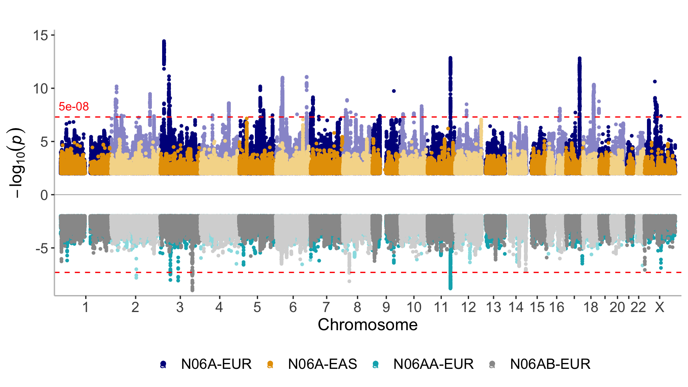

Antidepressant exposure GWAS meta-analysis manhattan plots
================

``` r
library(dplyr)
```

    ## Warning: package 'dplyr' was built under R version 4.2.3

    ## 
    ## Attaching package: 'dplyr'

    ## The following objects are masked from 'package:stats':
    ## 
    ##     filter, lag

    ## The following objects are masked from 'package:base':
    ## 
    ##     intersect, setdiff, setequal, union

``` r
library(readr)
library(stringr)
library(topr)
library(plyranges)
```

    ## Loading required package: BiocGenerics

    ## 
    ## Attaching package: 'BiocGenerics'

    ## The following objects are masked from 'package:dplyr':
    ## 
    ##     combine, intersect, setdiff, union

    ## The following objects are masked from 'package:stats':
    ## 
    ##     IQR, mad, sd, var, xtabs

    ## The following objects are masked from 'package:base':
    ## 
    ##     anyDuplicated, aperm, append, as.data.frame, basename, cbind,
    ##     colnames, dirname, do.call, duplicated, eval, evalq, Filter, Find,
    ##     get, grep, grepl, intersect, is.unsorted, lapply, Map, mapply,
    ##     match, mget, order, paste, pmax, pmax.int, pmin, pmin.int,
    ##     Position, rank, rbind, Reduce, rownames, sapply, setdiff, sort,
    ##     table, tapply, union, unique, unsplit, which.max, which.min

    ## Loading required package: IRanges

    ## Loading required package: S4Vectors

    ## Loading required package: stats4

    ## 
    ## Attaching package: 'S4Vectors'

    ## The following objects are masked from 'package:dplyr':
    ## 
    ##     first, rename

    ## The following objects are masked from 'package:base':
    ## 
    ##     expand.grid, I, unname

    ## 
    ## Attaching package: 'IRanges'

    ## The following objects are masked from 'package:dplyr':
    ## 
    ##     collapse, desc, slice

    ## Loading required package: GenomicRanges

    ## Loading required package: GenomeInfoDb

    ## 
    ## Attaching package: 'plyranges'

    ## The following object is masked from 'package:IRanges':
    ## 
    ##     slice

    ## The following objects are masked from 'package:dplyr':
    ## 
    ##     between, n, n_distinct

    ## The following object is masked from 'package:stats':
    ## 
    ##     filter

## Results

### Sumstats

``` r
metas <- c("N06A-EUR"  = "meta/fixed-N06A-EUR",
           "N06A-EAS"  = "meta/fixed-N06A-EAS",
           "N06AA-EUR" = "meta/fixed-N06AA-EUR",
           "N06AB-EUR" = "meta/fixed-N06AB-EUR")
           
sumstats_paths <- lapply(metas, function(.x) str_c(.x, "meta.gz", sep = "."))

sumstats <- lapply(sumstats_paths, function(path) {
    read_tsv(path) |>
        select(CHROM = CHR, POS = BP, ID = SNP,
               REF = A2, ALT = A1, P, OR,
               AF = starts_with("FRQ_U"))
})
```

    ## Rows: 10144170 Columns: 21
    ## ── Column specification ──────────────────────────────────────────────────────────────────────────────────────────────────────
    ## Delimiter: "\t"
    ## chr  (4): CHR, SNP, A1, A2
    ## dbl (17): BP, studies, OR, SE, P, OR_R, SE_R, P_R, Q, I, INFO, AFCAS, AFCON,...
    ## 
    ## ℹ Use `spec()` to retrieve the full column specification for this data.
    ## ℹ Specify the column types or set `show_col_types = FALSE` to quiet this message.
    ## Rows: 6821390 Columns: 21
    ## ── Column specification ──────────────────────────────────────────────────────────────────────────────────────────────────────
    ## Delimiter: "\t"
    ## chr  (4): CHR, SNP, A1, A2
    ## dbl (17): BP, studies, OR, SE, P, OR_R, SE_R, P_R, Q, I, INFO, AFCAS, AFCON,...
    ## 
    ## ℹ Use `spec()` to retrieve the full column specification for this data.
    ## ℹ Specify the column types or set `show_col_types = FALSE` to quiet this message.
    ## Rows: 9749594 Columns: 21
    ## ── Column specification ──────────────────────────────────────────────────────────────────────────────────────────────────────
    ## Delimiter: "\t"
    ## chr  (4): CHR, SNP, A1, A2
    ## dbl (17): BP, studies, OR, SE, P, OR_R, SE_R, P_R, Q, I, INFO, AFCAS, AFCON,...
    ## 
    ## ℹ Use `spec()` to retrieve the full column specification for this data.
    ## ℹ Specify the column types or set `show_col_types = FALSE` to quiet this message.
    ## Rows: 9748021 Columns: 21
    ## ── Column specification ──────────────────────────────────────────────────────────────────────────────────────────────────────
    ## Delimiter: "\t"
    ## chr  (4): CHR, SNP, A1, A2
    ## dbl (17): BP, studies, OR, SE, P, OR_R, SE_R, P_R, Q, I, INFO, AFCAS, AFCON,...
    ## 
    ## ℹ Use `spec()` to retrieve the full column specification for this data.
    ## ℹ Specify the column types or set `show_col_types = FALSE` to quiet this message.

### Loci

``` r
clumped_paths <- sumstats_paths <- lapply(metas, function(.x) str_c(.x, "clumped", sep = "."))

clumped <- lapply(clumped_paths[sapply(clumped_paths, file.exists)], read_table)
```

    ## 
    ## ── Column specification ───────────────────────────────────────────────────────────────────────────────────────────────────────────────
    ## cols(
    ##   CHR = col_double(),
    ##   F = col_double(),
    ##   SNP = col_character(),
    ##   BP = col_double(),
    ##   P = col_double(),
    ##   TOTAL = col_double(),
    ##   NSIG = col_double(),
    ##   S05 = col_double(),
    ##   S01 = col_double(),
    ##   S001 = col_double(),
    ##   S0001 = col_double(),
    ##   SP2 = col_character()
    ## )
    ## 
    ## 
    ## ── Column specification ───────────────────────────────────────────────────────────────────────────────────────────────────────────────
    ## cols(
    ##   CHR = col_double(),
    ##   F = col_double(),
    ##   SNP = col_character(),
    ##   BP = col_double(),
    ##   P = col_double(),
    ##   TOTAL = col_double(),
    ##   NSIG = col_double(),
    ##   S05 = col_double(),
    ##   S01 = col_double(),
    ##   S001 = col_double(),
    ##   S0001 = col_double(),
    ##   SP2 = col_character()
    ## )
    ## 
    ## 
    ## ── Column specification ───────────────────────────────────────────────────────────────────────────────────────────────────────────────
    ## cols(
    ##   CHR = col_double(),
    ##   F = col_double(),
    ##   SNP = col_character(),
    ##   BP = col_double(),
    ##   P = col_double(),
    ##   TOTAL = col_double(),
    ##   NSIG = col_double(),
    ##   S05 = col_double(),
    ##   S01 = col_double(),
    ##   S001 = col_double(),
    ##   S0001 = col_double(),
    ##   SP2 = col_character()
    ## )

``` r
ranges_paths <- sumstats_paths <- lapply(metas, function(.x) str_c(.x, "clumped.ranges", sep = "."))

clumped_ranges <- lapply(ranges_paths[sapply(ranges_paths, file.exists)], read_table)
```

    ## 
    ## ── Column specification ───────────────────────────────────────────────────────────────────────────────────────────────────────────────
    ## cols(
    ##   CHR = col_double(),
    ##   SNP = col_character(),
    ##   P = col_double(),
    ##   N = col_double(),
    ##   POS = col_character(),
    ##   KB = col_double(),
    ##   RANGES = col_character()
    ## )

    ## 
    ## ── Column specification ───────────────────────────────────────────────────────────────────────────────────────────────────────────────
    ## cols(
    ##   CHR = col_double(),
    ##   SNP = col_character(),
    ##   P = col_double(),
    ##   N = col_double(),
    ##   POS = col_character(),
    ##   KB = col_double(),
    ##   RANGES = col_character()
    ## )
    ## 
    ## 
    ## ── Column specification ───────────────────────────────────────────────────────────────────────────────────────────────────────────────
    ## cols(
    ##   CHR = col_double(),
    ##   SNP = col_character(),
    ##   P = col_double(),
    ##   N = col_double(),
    ##   POS = col_character(),
    ##   KB = col_double(),
    ##   RANGES = col_character()
    ## )

## Manhattan plot

``` r
sumstats2 <- lapply(sumstats, function(ss) filter(ss, P <= 1e-2))
manhattan(sumstats2, legend_labels = names(sumstats), ntop = 2, sign_thresh = 5e-08, build = 38,
    highlight_genes = c("ANO10, BPTF, CDH13, CNTNAP5, CYP7B1, DCAF5, DCC, ESR1, MAML3, MEGF11, PAX5, RSRC1, SGCZ, SORCS3, SOX5, TCF4, TMEM106B, ZNF445"))
```

<!-- -->

## Loci

Construct genomic ranges.

``` r
clumped_ranges_grs <- lapply(clumped_ranges, function(cr) {
    cr |>
    mutate(range = str_match(POS, "chr[0-9]+:([0-9]+)\\.\\.([0-9]+)")) |>
    transmute(seqnames = CHR, start = as.numeric(range[,2]), end = as.numeric(range[,3]), P, SNP) |>
    as_granges()
})

loci_ranges_grs <- lapply(clumped_ranges_grs, function(gr) {
    reduce_ranges(gr, SNPs = c(SNP), Ps = c(P))
})
```

Count number of loci

``` r
sapply(loci_ranges_grs, length)
```

    ##  N06A-EUR N06AA-EUR N06AB-EUR 
    ##        57         5         3

## Overlaps

``` r
find_overlaps(loci_ranges_grs[['N06A-EUR']], loci_ranges_grs[['N06AA-EUR']])
```

    ## GRanges object with 2 ranges and 4 metadata columns:
    ##       seqnames              ranges strand |                              SNPs.x
    ##          <Rle>           <IRanges>  <Rle> |                     <CharacterList>
    ##   [1]       11 112956144-113125732      * | rs7128648,rs17114702,rs35017949,...
    ##   [2]       11 112956144-113125732      * | rs7128648,rs17114702,rs35017949,...
    ##                                    Ps.x               SNPs.y
    ##                           <NumericList>      <CharacterList>
    ##   [1] 3.143e-13,4.731e-09,5.774e-13,... rs7128648,rs35017949
    ##   [2] 3.143e-13,4.731e-09,5.774e-13,...            rs1965775
    ##                      Ps.y
    ##             <NumericList>
    ##   [1] 1.545e-09,2.858e-09
    ##   [2]           8.111e-09
    ##   -------
    ##   seqinfo: 14 sequences from an unspecified genome; no seqlengths

``` r
find_overlaps(loci_ranges_grs[['N06A-EUR']], loci_ranges_grs[['N06AB-EUR']])
```

    ## GRanges object with 0 ranges and 4 metadata columns:
    ##    seqnames    ranges strand |          SNPs.x          Ps.x          SNPs.y
    ##       <Rle> <IRanges>  <Rle> | <CharacterList> <NumericList> <CharacterList>
    ##             Ps.y
    ##    <NumericList>
    ##   -------
    ##   seqinfo: 14 sequences from an unspecified genome; no seqlengths

## Regions

``` r
regionplot(sumstats, legend_labels = names(sumstats),
    chr = 11, xmin = 112956144, xmax = 113125732,
    build = 38, show_overview = FALSE)
```

    ## [1] "Zoomed to region:  11:112956144-113125732"

<!-- -->
