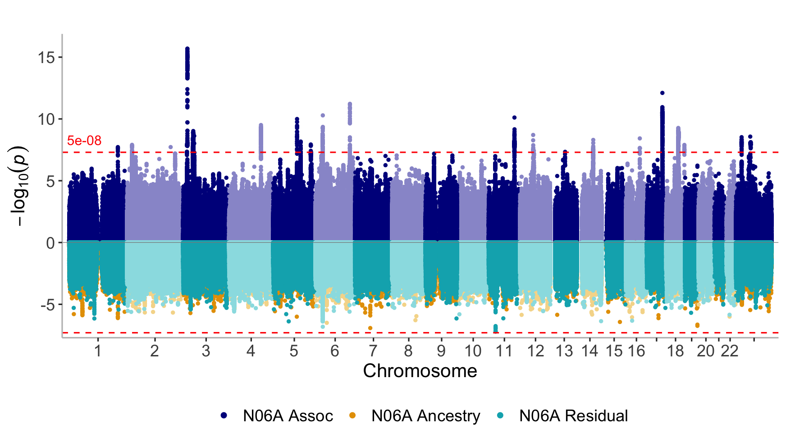

Antidepressant exposure GWAS multi-ancestry meta-analysis
================

``` r
library(dplyr)
library(readr)
library(stringr)
library(ggplot2)
library(ggrepel)
library(topr)
library(UpSetR)
library(plyranges)
library(ieugwasr)
library(gwascat)
```

## Principal components

``` r
mrmega_n06a_log <- read_lines("meta/mrmega-N06A.log")

pcs_start_idx <- which(mrmega_n06a_log == "Principal components:") + 1
pcs_end_idx <- which(mrmega_n06a_log == "Analysis finished.") - 1

pcs <- read_table(str_c(mrmega_n06a_log[seq(pcs_start_idx, pcs_end_idx)], sep="\\n")) |>
  mutate(dataset = str_remove(PCs, fixed(".txt.gz"))) |>
  mutate(cohort = str_remove(dataset, fixed("N06A-")))
  
ggplot(pcs, aes(x = PC0, y = PC1, label = cohort)) +
  geom_point() +
  geom_text_repel()
```

<!-- -->

## Manhattan plots

``` r
mrmega_n06a <- read_tsv("meta/mrmega-N06A.result.gz")
```

    ## Rows: 10967293 Columns: 28
    ## ── Column specification ──────────────────────────────────────────────────────────────────────────────────────────────────────────────────
    ## Delimiter: "\t"
    ## chr  (4): MarkerName, EA, NEA, Effects
    ## dbl (23): Chromosome, Position, EAF, Nsample, Ncohort, beta_0, se_0, beta_1,...
    ## lgl  (1): Comments
    ## 
    ## ℹ Use `spec()` to retrieve the full column specification for this data.
    ## ℹ Specify the column types or set `show_col_types = FALSE` to quiet this message.

``` r
mrmega_n06a_assoc <- list(
  "N06A Assoc" = select(mrmega_n06a, ID = MarkerName, CHROM = Chromosome, POS = Position, P = `P-value_association`),
  "N06A Ancestry" = select(mrmega_n06a, ID = MarkerName, CHROM = Chromosome, POS = Position, P = `P-value_ancestry_het`),
  "N06A Residual" = select(mrmega_n06a, ID = MarkerName, CHROM = Chromosome, POS = Position, P = `P-value_residual_het`))
```

``` r
manhattan(mrmega_n06a_assoc, legend_labels = names(mrmega_n06a_assoc), ntop = 1, sign_thresh = 5e-08, build = 38)
```

<!-- -->

## Clumps

``` r
clumps <- read_tsv("meta/mrmega-N06A.result.clumps")
```

    ## Rows: 1285 Columns: 12
    ## ── Column specification ──────────────────────────────────────────────────────────────────────────────────────────────────
    ## Delimiter: "\t"
    ## chr (3): ID, A1, SP2
    ## dbl (9): #CHROM, POS, P, TOTAL, NONSIG, S0.05, S0.01, S0.001, S0.0001
    ## 
    ## ℹ Use `spec()` to retrieve the full column specification for this data.
    ## ℹ Specify the column types or set `show_col_types = FALSE` to quiet this message.

``` r
clumps_gw <- clumps |>
  filter(P <= 5e-8) |>
  left_join(mrmega_n06a, by = c(`#CHROM` = "Chromosome", "POS" = "Position"))
  
clumps_gw_gr <- clumps_gw |>
  select(seqnames = `#CHROM`, start = POS, width = 1, P, SNP = MarkerName) |>
  as_granges() |>
  set_genome_info(genome = 'hg38')

mhc_gr <- tibble(seqnames = 6, start = 28510120, end = 33480577) |>
  as_granges() |>
  set_genome_info(genome = 'hg38')
  
clumps_gw_mhc_gr <-
clumps_gw_gr |>
  filter_by_overlaps(mhc_gr)
  
clumps_gw_nomhc_gr <-
clumps_gw_gr |>
  filter_by_non_overlaps(mhc_gr)
```

## Catalogue

``` r
open_gwas <- phewas(variants = clumps_gw_nomhc_gr |> as_tibble() |> pull(SNP), pval=5e-8)
```

``` r
gwcat <- get_cached_gwascat()

gwcat_snps <-
gwcat |>
  select(PUBMEDID, `DISEASE/TRAIT`, SNPS, MAPPED_TRAIT) |>
  separate_wider_delim(SNPS, delim = "; ", names_sep = "_", too_few = "align_start") |>
  pivot_longer(starts_with("SNP"), values_to = 'SNP') |>
  filter(!is.na(SNP)) |>
  select(-name)
```

``` r
nomhc_snps <- clumps_gw_nomhc_gr |> as_tibble() |> pull(SNP)
gwcat_snps |>
  filter(SNP %in% nomhc_snps) |>
  select(`DISEASE/TRAIT`, SNP) |>
  arrange(`DISEASE/TRAIT`) |>
  print(n = Inf)
```

    ## # A tibble: 32 × 2
    ##    `DISEASE/TRAIT`                                                         SNP  
    ##    <chr>                                                                   <chr>
    ##  1 Age at first sexual intercourse                                         rs72…
    ##  2 Age at first sexual intercourse                                         rs12…
    ##  3 Annual healthcare cost                                                  rs73…
    ##  4 Asthma and attention deficit hyperactivity disorder                     rs32…
    ##  5 Attention deficit hyperactivity disorder or autism spectrum disorder o… rs73…
    ##  6 Autism spectrum disorder                                                rs32…
    ##  7 Autism spectrum disorder (MTAG)                                         rs65…
    ##  8 Autism spectrum disorder (MTAG)                                         rs32…
    ##  9 Body mass index                                                         rs73…
    ## 10 Cognitive performance (MTAG)                                            rs72…
    ## 11 Depressive symptoms (MTAG)                                              rs65…
    ## 12 Educational attainment                                                  rs72…
    ## 13 Externalizing behaviour (multivariate analysis)                         rs76…
    ## 14 Externalizing behaviour (multivariate analysis)                         rs12…
    ## 15 Highest math class taken (MTAG)                                         rs72…
    ## 16 Intelligence                                                            rs73…
    ## 17 Intelligence                                                            rs73…
    ## 18 Intelligence (MTAG)                                                     rs73…
    ## 19 Irritable bowel syndrome (MTAG)                                         rs18…
    ## 20 Irritable bowel syndrome or major depressive disorder (pleiotropy)      rs18…
    ## 21 Major depressive disorder (MTAG)                                        rs65…
    ## 22 Major depressive disorder or stress-related disorder                    rs32…
    ## 23 Monocyte chemoattractant protein-1 levels                               rs73…
    ## 24 Multisite chronic pain                                                  rs32…
    ## 25 Myocardial infarction                                                   rs73…
    ## 26 Myocardial infarction                                                   rs73…
    ## 27 Neuropsychiatric disorders                                              rs23…
    ## 28 Neuroticism                                                             rs98…
    ## 29 Self-reported math ability (MTAG)                                       rs72…
    ## 30 Smoking status                                                          rs23…
    ## 31 Triglyceride levels                                                     rs32…
    ## 32 Waist circumference adjusted for body mass index                        rs73…
