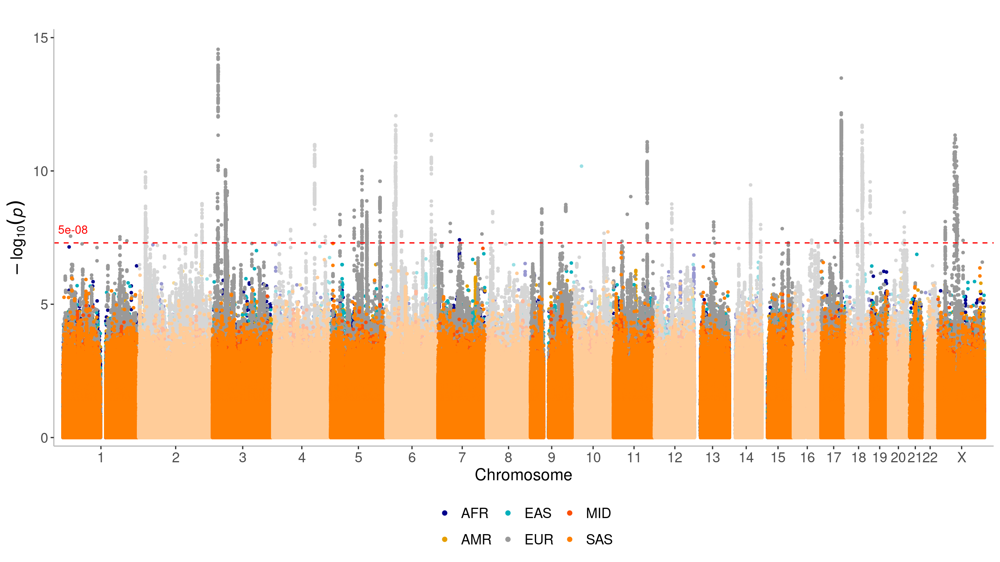

Antidepressant exposure GWAS fixed-effects meta-analysis
================

``` r
library(dplyr)
library(here)
library(readr)
library(stringr)
library(tidyr)
library(topr)
library(UpSetR)
library(plyranges)
library(ggplot2)
```

## GWAS results

### Sumstats

Load all sumstats and label with `CLUSTER-PHENO`. Only retain chromsome,
position, and p-value for plotting. Remove SNPs in alt regions.

``` r
# Use here to create paths relative to the top-level directory
# Specify which meta-analysis version to plot
metaset <- "antidep-2501"
# list fixed effects sumstats (.gz) files
sumstats_paths <- list.files(
  here::here("results", "meta", metaset),
  str_c(metaset, "-fixed-.+\\.gz"),
  full.names = TRUE
)
# simply names for plotting
prefixes <- str_remove(basename(sumstats_paths), ".gz")
metas <- str_remove(prefixes, str_c(metaset, "-fixed-"))

names(sumstats_paths) <- metas

sumstats <- lapply(sumstats_paths, function(path) {
  read_tsv(path) |>
    select(CHROM, POS, P) |>
    # only keep chromosomes chr1-chr22 and chrX
    # (removes chromsomes with extra info on the end indicating
    #  and alt or unplaced region)
    filter(str_detect(CHROM, pattern = "^chr[0-9X]+$"))
})
```

    ## Rows: 25029825 Columns: 19
    ## ── Column specification ─────────────────────────────────────────────────────────────────────────────────────────────────────────
    ## Delimiter: "\t"
    ## chr  (4): CHROM, ID, REF, ALT
    ## dbl (15): POS, studies, BETA, SE, CHISQ, P, Q, QP, INFO, AFCAS, AFCON, NCAS,...
    ## 
    ## ℹ Use `spec()` to retrieve the full column specification for this data.
    ## ℹ Specify the column types or set `show_col_types = FALSE` to quiet this message.
    ## Rows: 17066490 Columns: 19
    ## ── Column specification ─────────────────────────────────────────────────────────────────────────────────────────────────────────
    ## Delimiter: "\t"
    ## chr  (4): CHROM, ID, REF, ALT
    ## dbl (15): POS, studies, BETA, SE, CHISQ, P, Q, QP, INFO, AFCAS, AFCON, NCAS,...
    ## 
    ## ℹ Use `spec()` to retrieve the full column specification for this data.
    ## ℹ Specify the column types or set `show_col_types = FALSE` to quiet this message.
    ## Rows: 13429399 Columns: 19
    ## ── Column specification ─────────────────────────────────────────────────────────────────────────────────────────────────────────
    ## Delimiter: "\t"
    ## chr  (4): CHROM, ID, REF, ALT
    ## dbl (15): POS, studies, BETA, SE, CHISQ, P, Q, QP, INFO, AFCAS, AFCON, NCAS,...
    ## 
    ## ℹ Use `spec()` to retrieve the full column specification for this data.
    ## ℹ Specify the column types or set `show_col_types = FALSE` to quiet this message.
    ## Rows: 15885140 Columns: 19
    ## ── Column specification ─────────────────────────────────────────────────────────────────────────────────────────────────────────
    ## Delimiter: "\t"
    ## chr  (4): CHROM, ID, REF, ALT
    ## dbl (15): POS, studies, BETA, SE, CHISQ, P, Q, QP, INFO, AFCAS, AFCON, NCAS,...
    ## 
    ## ℹ Use `spec()` to retrieve the full column specification for this data.
    ## ℹ Specify the column types or set `show_col_types = FALSE` to quiet this message.
    ## Rows: 11556922 Columns: 19
    ## ── Column specification ─────────────────────────────────────────────────────────────────────────────────────────────────────────
    ## Delimiter: "\t"
    ## chr  (4): CHROM, ID, REF, ALT
    ## dbl (15): POS, studies, BETA, SE, CHISQ, P, Q, QP, INFO, AFCAS, AFCON, NCAS,...
    ## 
    ## ℹ Use `spec()` to retrieve the full column specification for this data.
    ## ℹ Specify the column types or set `show_col_types = FALSE` to quiet this message.
    ## Rows: 14178029 Columns: 19
    ## ── Column specification ─────────────────────────────────────────────────────────────────────────────────────────────────────────
    ## Delimiter: "\t"
    ## chr  (4): CHROM, ID, REF, ALT
    ## dbl (15): POS, studies, BETA, SE, CHISQ, P, Q, QP, INFO, AFCAS, AFCON, NCAS,...
    ## 
    ## ℹ Use `spec()` to retrieve the full column specification for this data.
    ## ℹ Specify the column types or set `show_col_types = FALSE` to quiet this message.
    ## Rows: 24971597 Columns: 19
    ## ── Column specification ─────────────────────────────────────────────────────────────────────────────────────────────────────────
    ## Delimiter: "\t"
    ## chr  (4): CHROM, ID, REF, ALT
    ## dbl (15): POS, studies, BETA, SE, CHISQ, P, Q, QP, INFO, AFCAS, AFCON, NCAS,...
    ## 
    ## ℹ Use `spec()` to retrieve the full column specification for this data.
    ## ℹ Specify the column types or set `show_col_types = FALSE` to quiet this message.
    ## Rows: 14044866 Columns: 19
    ## ── Column specification ─────────────────────────────────────────────────────────────────────────────────────────────────────────
    ## Delimiter: "\t"
    ## chr  (4): CHROM, ID, REF, ALT
    ## dbl (15): POS, studies, BETA, SE, CHISQ, P, Q, QP, INFO, AFCAS, AFCON, NCAS,...
    ## 
    ## ℹ Use `spec()` to retrieve the full column specification for this data.
    ## ℹ Specify the column types or set `show_col_types = FALSE` to quiet this message.
    ## Rows: 14058662 Columns: 19
    ## ── Column specification ─────────────────────────────────────────────────────────────────────────────────────────────────────────
    ## Delimiter: "\t"
    ## chr  (4): CHROM, ID, REF, ALT
    ## dbl (15): POS, studies, BETA, SE, CHISQ, P, Q, QP, INFO, AFCAS, AFCON, NCAS,...
    ## 
    ## ℹ Use `spec()` to retrieve the full column specification for this data.
    ## ℹ Specify the column types or set `show_col_types = FALSE` to quiet this message.
    ## Rows: 24994551 Columns: 19
    ## ── Column specification ─────────────────────────────────────────────────────────────────────────────────────────────────────────
    ## Delimiter: "\t"
    ## chr  (4): CHROM, ID, REF, ALT
    ## dbl (15): POS, studies, BETA, SE, CHISQ, P, Q, QP, INFO, AFCAS, AFCON, NCAS,...
    ## 
    ## ℹ Use `spec()` to retrieve the full column specification for this data.
    ## ℹ Specify the column types or set `show_col_types = FALSE` to quiet this message.
    ## Rows: 14077542 Columns: 19
    ## ── Column specification ─────────────────────────────────────────────────────────────────────────────────────────────────────────
    ## Delimiter: "\t"
    ## chr  (4): CHROM, ID, REF, ALT
    ## dbl (15): POS, studies, BETA, SE, CHISQ, P, Q, QP, INFO, AFCAS, AFCON, NCAS,...
    ## 
    ## ℹ Use `spec()` to retrieve the full column specification for this data.
    ## ℹ Specify the column types or set `show_col_types = FALSE` to quiet this message.
    ## Rows: 11525458 Columns: 19
    ## ── Column specification ─────────────────────────────────────────────────────────────────────────────────────────────────────────
    ## Delimiter: "\t"
    ## chr  (4): CHROM, ID, REF, ALT
    ## dbl (15): POS, studies, BETA, SE, CHISQ, P, Q, QP, INFO, AFCAS, AFCON, NCAS,...
    ## 
    ## ℹ Use `spec()` to retrieve the full column specification for this data.
    ## ℹ Specify the column types or set `show_col_types = FALSE` to quiet this message.
    ## Rows: 14158341 Columns: 19
    ## ── Column specification ─────────────────────────────────────────────────────────────────────────────────────────────────────────
    ## Delimiter: "\t"
    ## chr  (4): CHROM, ID, REF, ALT
    ## dbl (15): POS, studies, BETA, SE, CHISQ, P, Q, QP, INFO, AFCAS, AFCON, NCAS,...
    ## 
    ## ℹ Use `spec()` to retrieve the full column specification for this data.
    ## ℹ Specify the column types or set `show_col_types = FALSE` to quiet this message.

### Loci

Collate all clump files together and mark which meta-analysis they are
from.

``` r
clumps_paths <- list.files(
  here::here("results", "meta", metaset),
  str_c(metaset, "-fixed-.+\\.clumps\\.tsv"),
  full.names = TRUE
)
clump_prefixes <- str_remove(basename(clumps_paths), ".clumps.tsv")
names(clumps_paths) <- str_remove(clump_prefixes, str_c(metaset, "-fixed-"))

clumps <- lapply(clumps_paths, read_table, col_types = cols(REF = col_character(), ALT = col_character()))

clumps_table <- bind_rows(clumps, .id = "dataset")
```

Write out clump file and column descriptions.

``` r
table_basename <- str_glue("clumps_fixed_{metaset}.clumps.csv")
write_csv(clumps_table, here::here("manuscript", "tables", table_basename))

colname_descriptions <-
  c("dataset" = "meta-analysis dataset (phenotype-cluster)",
    "LOCUS" = "locus number from clumping analysis",
    "CHROM" = "chromosome",
    "POS" = "base position in hg38",
    "ID" = "variant identifier",
    "REF" = "reference allele",
    "ALT" = "alternate allele",
    "studies" = "number of studies",
    "BETA" = "beta estimate",
    "SE" = "standard error of beta estimate",
    "CHISQ" = "chi-squared statistic",
    "P" = "p-value",
    "Q" = "Q statistic",
    "QP" = "Q p-value",
    "INFO" = "imputation accuracy",
    "AFCAS" = "allele frequency in cases",
    "AFCON" = "allele frequency in controls",
    "NCAS" = "number of cases",
    "NCON" = "number of controls",
    "NEFF" = "effective sample size",
    "NTOT" = "total sample size",
    "start" = "start position of the locus",
    "end" =  "end position of the locus")

colname_descriptions_table <- tibble(column = names(colname_descriptions), description = colname_descriptions)

# check that all names match
if (any(names(clumps_table) != names(colname_descriptions))) {
  stop(str_glue("column names in {table_basename}.csv are not all in colname_descriptions"))
}

write_tsv(colname_descriptions_table, here::here("manuscript", "tables", str_glue("{table_basename}.cols")))
```

## Manhattan plots

Find smallest p-value to draw all Manhattan plots on the same scale.

``` r
min_p <- min(sapply(sumstats, function(sumstat) min(sumstat$P, na.rm = TRUE)))
```

Assign consistent color to each cluster

``` r
clusters <- unique(sapply(str_split(names(sumstats), pattern = "-"), last))
cluster_colors <- get_topr_colors()[seq_along(clusters)]
names(cluster_colors) <- clusters
```

### N06A

``` r
sumstats_n06a <- sumstats[which(str_detect(names(sumstats), "N06A-"))]
clusters_n06a <- sapply(str_split(names(sumstats_n06a), pattern = "-"), last)
manhattan(
  sumstats_n06a,
  legend_labels = clusters_n06a,
  color = cluster_colors[clusters_n06a],
  ntop = length(sumstats_n06a),
  sign_thresh = 5e-08,
  ymax = ceiling(-log10(min_p)),
  build = 38,
  chr_ticknames = c(1:22, "X")
)
```

<!-- -->

## Loci

Construct genomic ranges.

``` r
clumped_ranges_grs <- lapply(clumps, function(cr) {
  cr |>
    as_granges(seqnames = CHROM, start = start, end = end) |>
    set_genome_info(genome = "hg38")
})
```

Count number of loci

``` r
sapply(clumped_ranges_grs, length)
```

    ##  N06A-AFR  N06A-EAS  N06A-EUR  N06A-SAS N06AA-AFR N06AA-EUR N06AB-AFR N06AB-EUR 
    ##         1         1        59         1         1         6         2         4 
    ## N06AB-MID N06AB-SAS 
    ##         1         1

## Overlaps

``` r
all_gr <- reduce_ranges(bind_ranges(clumped_ranges_grs))

hits_upset <- lapply(clumped_ranges_grs, function(gr) findOverlaps(all_gr, gr)@from)

upset(fromList(hits_upset), nsets = length(hits_upset), order.by = "freq", text.scale = 2)
```

<!-- -->

## Regions

``` r
regionplot(
  sumstats["N06A-EUR"], legend_labels = names(sumstats["N06A-EUR"]),
  chr = 11, xmin = 112956144, xmax = 113578846,
  build = 38, show_overview = FALSE
)
```

    ## [1] "Zoomed to region:  11:112956144-113578846"

<!-- -->
