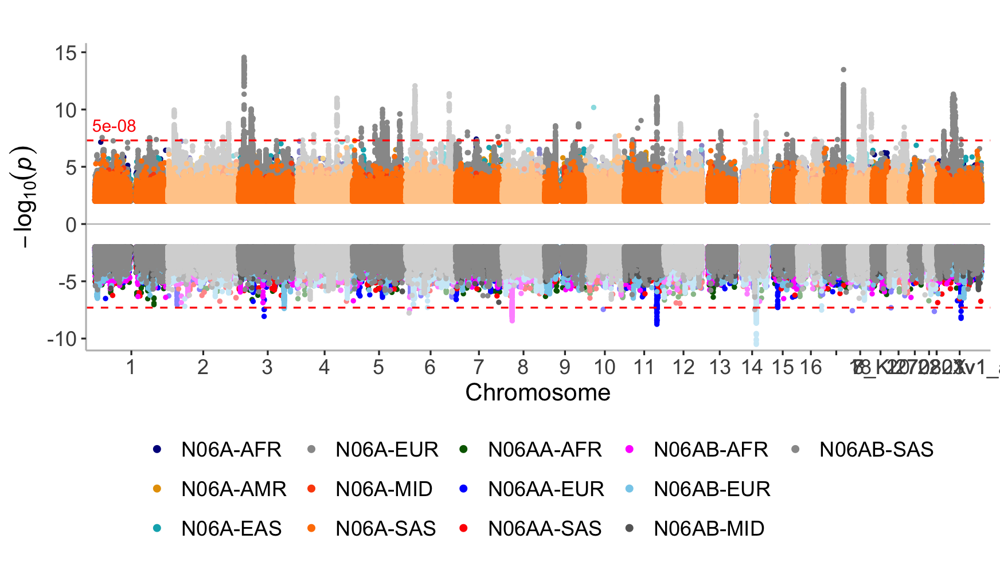
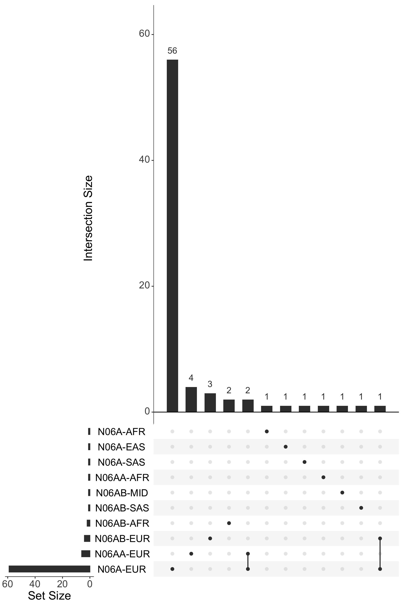
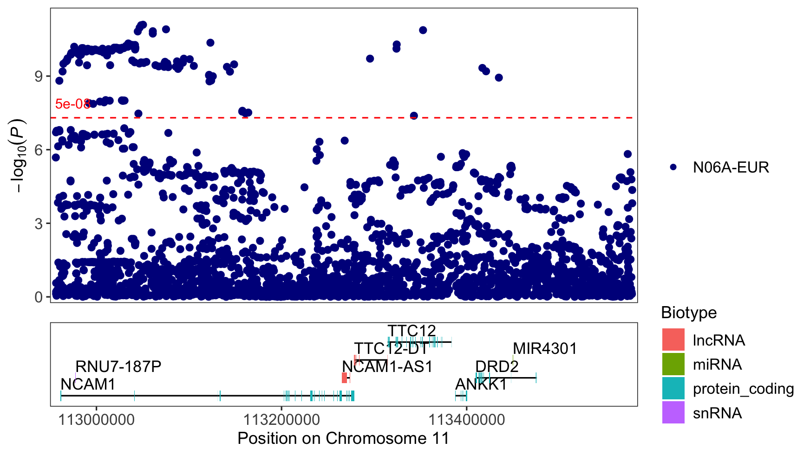

Antidepressant exposure GWAS fixed-effects meta-analysis
================

``` r
library(dplyr)
library(here)
library(readr)
library(stringr)
library(tidyr)
library(topr)
library(UpSetR)
library(plyranges)
library(ggplot2)
```

## GWAS results

### Sumstats

``` r
# Use here to create paths relative to the top-level directory
# Specify which meta-analysis version to plot
metaset <- "antidep-2501"
# list fixed effects susmtats (.gz) files
sumstats_paths <- list.files(here::here("results", "meta", metaset), str_c(metaset, "-fixed-.+\\.gz"), full.names = TRUE)
# simply names for plotting
prefixes <- str_remove(basename(sumstats_paths), ".gz")
metas <- str_remove(prefixes, str_c(metaset, "-fixed-"))
           
names(sumstats_paths) <- metas

sumstats <- lapply(sumstats_paths, function(path) {
    read_tsv(path) |>
        select(CHROM, POS, P)
})
```

    ## Rows: 25029825 Columns: 19
    ## ── Column specification ──────────────────────────────────────────────────────────────────────────────────────────────
    ## Delimiter: "\t"
    ## chr  (4): CHROM, ID, REF, ALT
    ## dbl (15): POS, studies, BETA, SE, CHISQ, P, Q, QP, INFO, AFCAS, AFCON, NCAS,...
    ## 
    ## ℹ Use `spec()` to retrieve the full column specification for this data.
    ## ℹ Specify the column types or set `show_col_types = FALSE` to quiet this message.
    ## Rows: 17066490 Columns: 19
    ## ── Column specification ──────────────────────────────────────────────────────────────────────────────────────────────
    ## Delimiter: "\t"
    ## chr  (4): CHROM, ID, REF, ALT
    ## dbl (15): POS, studies, BETA, SE, CHISQ, P, Q, QP, INFO, AFCAS, AFCON, NCAS,...
    ## 
    ## ℹ Use `spec()` to retrieve the full column specification for this data.
    ## ℹ Specify the column types or set `show_col_types = FALSE` to quiet this message.
    ## Rows: 13429399 Columns: 19
    ## ── Column specification ──────────────────────────────────────────────────────────────────────────────────────────────
    ## Delimiter: "\t"
    ## chr  (4): CHROM, ID, REF, ALT
    ## dbl (15): POS, studies, BETA, SE, CHISQ, P, Q, QP, INFO, AFCAS, AFCON, NCAS,...
    ## 
    ## ℹ Use `spec()` to retrieve the full column specification for this data.
    ## ℹ Specify the column types or set `show_col_types = FALSE` to quiet this message.
    ## Rows: 15885140 Columns: 19
    ## ── Column specification ──────────────────────────────────────────────────────────────────────────────────────────────
    ## Delimiter: "\t"
    ## chr  (4): CHROM, ID, REF, ALT
    ## dbl (15): POS, studies, BETA, SE, CHISQ, P, Q, QP, INFO, AFCAS, AFCON, NCAS,...
    ## 
    ## ℹ Use `spec()` to retrieve the full column specification for this data.
    ## ℹ Specify the column types or set `show_col_types = FALSE` to quiet this message.
    ## Rows: 11556922 Columns: 19
    ## ── Column specification ──────────────────────────────────────────────────────────────────────────────────────────────
    ## Delimiter: "\t"
    ## chr  (4): CHROM, ID, REF, ALT
    ## dbl (15): POS, studies, BETA, SE, CHISQ, P, Q, QP, INFO, AFCAS, AFCON, NCAS,...
    ## 
    ## ℹ Use `spec()` to retrieve the full column specification for this data.
    ## ℹ Specify the column types or set `show_col_types = FALSE` to quiet this message.
    ## Rows: 14178029 Columns: 19
    ## ── Column specification ──────────────────────────────────────────────────────────────────────────────────────────────
    ## Delimiter: "\t"
    ## chr  (4): CHROM, ID, REF, ALT
    ## dbl (15): POS, studies, BETA, SE, CHISQ, P, Q, QP, INFO, AFCAS, AFCON, NCAS,...
    ## 
    ## ℹ Use `spec()` to retrieve the full column specification for this data.
    ## ℹ Specify the column types or set `show_col_types = FALSE` to quiet this message.
    ## Rows: 24971597 Columns: 19
    ## ── Column specification ──────────────────────────────────────────────────────────────────────────────────────────────
    ## Delimiter: "\t"
    ## chr  (4): CHROM, ID, REF, ALT
    ## dbl (15): POS, studies, BETA, SE, CHISQ, P, Q, QP, INFO, AFCAS, AFCON, NCAS,...
    ## 
    ## ℹ Use `spec()` to retrieve the full column specification for this data.
    ## ℹ Specify the column types or set `show_col_types = FALSE` to quiet this message.
    ## Rows: 14044866 Columns: 19
    ## ── Column specification ──────────────────────────────────────────────────────────────────────────────────────────────
    ## Delimiter: "\t"
    ## chr  (4): CHROM, ID, REF, ALT
    ## dbl (15): POS, studies, BETA, SE, CHISQ, P, Q, QP, INFO, AFCAS, AFCON, NCAS,...
    ## 
    ## ℹ Use `spec()` to retrieve the full column specification for this data.
    ## ℹ Specify the column types or set `show_col_types = FALSE` to quiet this message.
    ## Rows: 14058662 Columns: 19
    ## ── Column specification ──────────────────────────────────────────────────────────────────────────────────────────────
    ## Delimiter: "\t"
    ## chr  (4): CHROM, ID, REF, ALT
    ## dbl (15): POS, studies, BETA, SE, CHISQ, P, Q, QP, INFO, AFCAS, AFCON, NCAS,...
    ## 
    ## ℹ Use `spec()` to retrieve the full column specification for this data.
    ## ℹ Specify the column types or set `show_col_types = FALSE` to quiet this message.
    ## Rows: 24994551 Columns: 19
    ## ── Column specification ──────────────────────────────────────────────────────────────────────────────────────────────
    ## Delimiter: "\t"
    ## chr  (4): CHROM, ID, REF, ALT
    ## dbl (15): POS, studies, BETA, SE, CHISQ, P, Q, QP, INFO, AFCAS, AFCON, NCAS,...
    ## 
    ## ℹ Use `spec()` to retrieve the full column specification for this data.
    ## ℹ Specify the column types or set `show_col_types = FALSE` to quiet this message.
    ## Rows: 14077542 Columns: 19
    ## ── Column specification ──────────────────────────────────────────────────────────────────────────────────────────────
    ## Delimiter: "\t"
    ## chr  (4): CHROM, ID, REF, ALT
    ## dbl (15): POS, studies, BETA, SE, CHISQ, P, Q, QP, INFO, AFCAS, AFCON, NCAS,...
    ## 
    ## ℹ Use `spec()` to retrieve the full column specification for this data.
    ## ℹ Specify the column types or set `show_col_types = FALSE` to quiet this message.
    ## Rows: 11525458 Columns: 19
    ## ── Column specification ──────────────────────────────────────────────────────────────────────────────────────────────
    ## Delimiter: "\t"
    ## chr  (4): CHROM, ID, REF, ALT
    ## dbl (15): POS, studies, BETA, SE, CHISQ, P, Q, QP, INFO, AFCAS, AFCON, NCAS,...
    ## 
    ## ℹ Use `spec()` to retrieve the full column specification for this data.
    ## ℹ Specify the column types or set `show_col_types = FALSE` to quiet this message.
    ## Rows: 14158341 Columns: 19
    ## ── Column specification ──────────────────────────────────────────────────────────────────────────────────────────────
    ## Delimiter: "\t"
    ## chr  (4): CHROM, ID, REF, ALT
    ## dbl (15): POS, studies, BETA, SE, CHISQ, P, Q, QP, INFO, AFCAS, AFCON, NCAS,...
    ## 
    ## ℹ Use `spec()` to retrieve the full column specification for this data.
    ## ℹ Specify the column types or set `show_col_types = FALSE` to quiet this message.

### Loci

``` r
clumps_paths <- list.files(here::here("results", "meta", metaset), str_c(metaset, "-fixed-.+\\.clumps\\.tsv"), full.names = TRUE)
clump_prefixes <- str_remove(basename(clumps_paths), ".clumps.tsv")
names(clumps_paths) <- str_remove(clump_prefixes, str_c(metaset, "-fixed-"))

clumps <- lapply(clumps_paths, read_table)
```

    ## 
    ## ── Column specification ──────────────────────────────────────────────────────────────────────────────────────────────
    ## cols(
    ##   .default = col_double(),
    ##   CHROM = col_character(),
    ##   ID = col_character(),
    ##   REF = col_character(),
    ##   ALT = col_character()
    ## )
    ## ℹ Use `spec()` for the full column specifications.

    ## 
    ## ── Column specification ──────────────────────────────────────────────────────────────────────────────────────────────
    ## cols(
    ##   .default = col_double(),
    ##   CHROM = col_character(),
    ##   ID = col_character(),
    ##   REF = col_logical(),
    ##   ALT = col_character()
    ## )
    ## ℹ Use `spec()` for the full column specifications.

    ## 
    ## ── Column specification ──────────────────────────────────────────────────────────────────────────────────────────────
    ## cols(
    ##   .default = col_double(),
    ##   CHROM = col_character(),
    ##   ID = col_character(),
    ##   REF = col_character(),
    ##   ALT = col_character()
    ## )
    ## ℹ Use `spec()` for the full column specifications.

    ## 
    ## ── Column specification ──────────────────────────────────────────────────────────────────────────────────────────────
    ## cols(
    ##   .default = col_double(),
    ##   CHROM = col_character(),
    ##   ID = col_character(),
    ##   REF = col_character(),
    ##   ALT = col_logical(),
    ##   Q = col_logical(),
    ##   QP = col_logical()
    ## )
    ## ℹ Use `spec()` for the full column specifications.

    ## 
    ## ── Column specification ──────────────────────────────────────────────────────────────────────────────────────────────
    ## cols(
    ##   .default = col_double(),
    ##   CHROM = col_character(),
    ##   ID = col_character(),
    ##   REF = col_character(),
    ##   ALT = col_character()
    ## )
    ## ℹ Use `spec()` for the full column specifications.
    ## 
    ## 
    ## ── Column specification ──────────────────────────────────────────────────────────────────────────────────────────────
    ## cols(
    ##   .default = col_double(),
    ##   CHROM = col_character(),
    ##   ID = col_character(),
    ##   REF = col_character(),
    ##   ALT = col_character()
    ## )
    ## ℹ Use `spec()` for the full column specifications.
    ## 
    ## 
    ## ── Column specification ──────────────────────────────────────────────────────────────────────────────────────────────
    ## cols(
    ##   .default = col_double(),
    ##   CHROM = col_character(),
    ##   ID = col_character(),
    ##   REF = col_character(),
    ##   ALT = col_character()
    ## )
    ## ℹ Use `spec()` for the full column specifications.
    ## 
    ## 
    ## ── Column specification ──────────────────────────────────────────────────────────────────────────────────────────────
    ## cols(
    ##   .default = col_double(),
    ##   CHROM = col_character(),
    ##   ID = col_character(),
    ##   REF = col_character(),
    ##   ALT = col_character()
    ## )
    ## ℹ Use `spec()` for the full column specifications.

    ## 
    ## ── Column specification ──────────────────────────────────────────────────────────────────────────────────────────────
    ## cols(
    ##   .default = col_double(),
    ##   CHROM = col_character(),
    ##   ID = col_character(),
    ##   REF = col_logical(),
    ##   ALT = col_character(),
    ##   Q = col_logical(),
    ##   QP = col_logical()
    ## )
    ## ℹ Use `spec()` for the full column specifications.

    ## 
    ## ── Column specification ──────────────────────────────────────────────────────────────────────────────────────────────
    ## cols(
    ##   .default = col_double(),
    ##   CHROM = col_character(),
    ##   ID = col_character(),
    ##   REF = col_character(),
    ##   ALT = col_logical()
    ## )
    ## ℹ Use `spec()` for the full column specifications.

## Manhattan plot

``` r
sumstats2 <- lapply(sumstats, function(ss) filter(ss, P <= 1e-2))
manhattan(sumstats2, legend_labels = names(sumstats), ntop = 6, sign_thresh = 5e-08, build = 38)
```

<!-- -->

## Loci

Construct genomic ranges.

``` r
clumped_ranges_grs <- lapply(clumps, function(cr) {
    cr |>
    as_granges(seqnames = CHROM, start = start, end = end) |>
    set_genome_info(genome = "hg38")
})
```

Count number of loci

``` r
sapply(clumped_ranges_grs, length)
```

    ##  N06A-AFR  N06A-EAS  N06A-EUR  N06A-SAS N06AA-AFR N06AA-EUR N06AB-AFR N06AB-EUR 
    ##         1         1        59         1         1         6         2         4 
    ## N06AB-MID N06AB-SAS 
    ##         1         1

## Overlaps

``` r
all_gr <- reduce_ranges(bind_ranges(clumped_ranges_grs))

hits_upset <- lapply(clumped_ranges_grs, function(gr) findOverlaps(all_gr, gr)@from)

upset(fromList(hits_upset), nsets = length(hits_upset), order.by='freq', text.scale=2)
```

<!-- -->

## Regions

``` r
regionplot(sumstats["N06A-EUR"], legend_labels = names(sumstats["N06A-EUR"]),
    chr = 11, xmin = 112956144, xmax = 113578846,
    build = 38, show_overview = FALSE)
```

    ## [1] "Zoomed to region:  11:112956144-113578846"

<!-- -->
