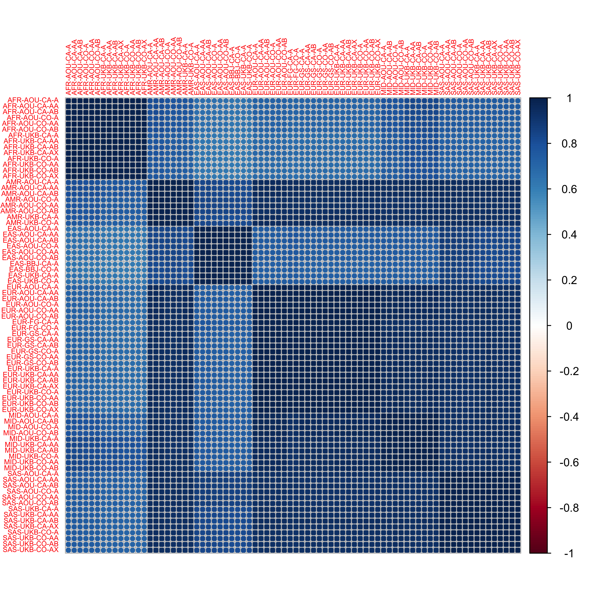

As a quality control step, correlations of allele frequncies were
calculated between all pairs of GWAS summary statitics.

``` r
library(dplyr)
library(readr)
library(stringr)
library(tidyr)
library(corrplot)
```

Correlation table:

``` r
af_corr <- read_csv(here::here("manuscript/tables/antidep-2501.corr.csv"))
```

    ## Rows: 78 Columns: 78
    ## ── Column specification ─────────────────────────────────────────────────────────────────────────────────────────────
    ## Delimiter: ","
    ## dbl (78): UKB-N06A-AMR-21007_2309.AFCAS, UKB-N06A-AMR-21007_2309.AFCON, Finn...
    ## 
    ## ℹ Use `spec()` to retrieve the full column specification for this data.
    ## ℹ Specify the column types or set `show_col_types = FALSE` to quiet this message.

Parse dataset information from names.

``` r
dataset_names <- tibble(dataset = names(af_corr)) |> 
  separate_wider_delim(
    col = dataset,
    delim = regex("[-.]"),
    names = c("cohort", "phenotype", "cluster", "version", "status"),
    cols_remove = FALSE
  ) |>
  mutate(
    cohort = case_match(
      cohort,
      "UKB" ~ "UKB",
      "FinnGen" ~ "FG",
      "AllOfUs" ~ "AOU",
      "GenScot" ~ "GS",
      "BBJ" ~ "BBJ"
    ),
    phenotype = str_remove(phenotype, "N06"),
    status = case_match(
      status,
      "AFCAS" ~ "CA",
      "AFCON" ~ "CO"
    )
  ) |>
  mutate(
    shortname = str_glue("{cluster}-{cohort}-{status}-{phenotype}")
  ) |>
  arrange(cluster, cohort, status, phenotype)

shortnames <- as.character(dataset_names[['shortname']])
names(shortnames) <- dataset_names[['dataset']]
```

``` r
# turn into a matrix
af_corr_matrix <- as.matrix(af_corr)
# rename columns with short names
colnames(af_corr_matrix) <- shortnames[colnames(af_corr_matrix)]
rownames(af_corr_matrix) <- colnames(af_corr_matrix)
# sort names
af_corr_matrix <- af_corr_matrix[sort(shortnames), sort(shortnames)]
```

``` r
corrplot(af_corr_matrix, tl.cex = 0.5)
```

<!-- -->
