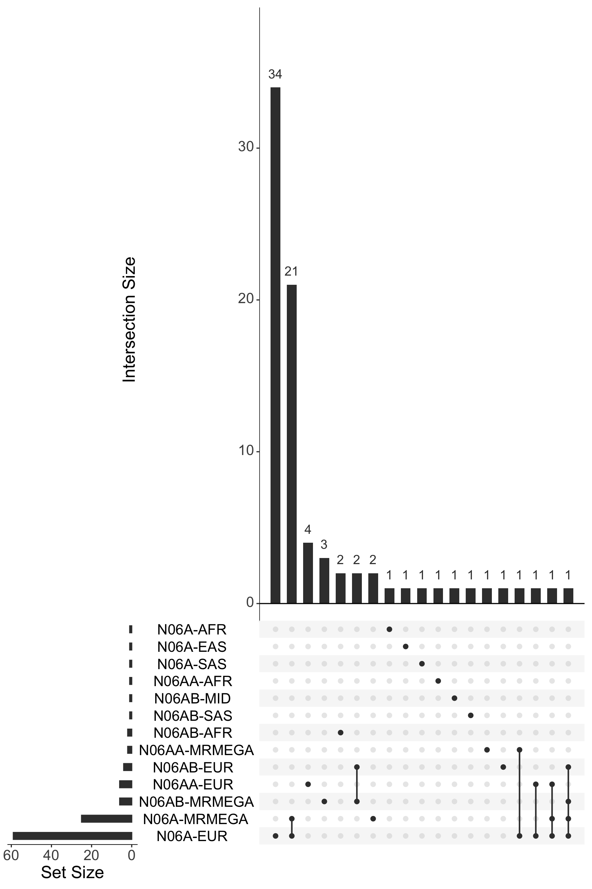

Antidepressant exposure GWAS meta-analysis loci
================

``` r
library(dplyr)
library(here)
library(readr)
library(stringr)
library(tidyr)
library(topr)
library(UpSetR)
library(plyranges)
library(ggplot2)
```

``` r
metaset <- "antidep-2501"
```

## Clumps

Collate all clump files together and mark which meta-analysis they are
from.

``` r
clumps_paths <- list.files(
  here::here("results", "meta", metaset),
  str_c(metaset, ".+\\.clumps\\.tsv"),
  full.names = TRUE
)
clump_prefixes <- str_remove(basename(clumps_paths), ".clumps.tsv")

pheno_cluster <- sapply(str_split(clump_prefixes, pattern = "-"), function(x) str_c(x[4], x[5], sep = "-"))
pheno_cluster <- str_replace(pheno_cluster, "DIV", "MRMEGA")

names(clumps_paths) <- pheno_cluster

clumps <- lapply(clumps_paths, read_table, col_types = cols(REF = col_character(), ALT = col_character()))
```

    ## Warning: The following named parsers don't match the column names: REF, ALT
    ## Warning: The following named parsers don't match the column names: REF, ALT
    ## Warning: The following named parsers don't match the column names: REF, ALT

## Genomics ranges

Construct genomic ranges.

``` r
clumped_ranges_grs <- lapply(clumps, function(cr) {
  cr |>
    select(CHROM = matches("chrom"), start, end) |>
    mutate(CHROM = str_remove(CHROM, "chr")) |>
    as_granges(seqnames = CHROM, start = start, end = end) |>
    set_genome_info(genome = "hg38")
})
```

Count number of loci

``` r
sapply(clumped_ranges_grs, length)
```

    ##     N06A-AFR     N06A-EAS     N06A-EUR     N06A-SAS    N06AA-AFR    N06AA-EUR 
    ##            1            1           59            1            1            6 
    ##    N06AB-AFR    N06AB-EUR    N06AB-MID    N06AB-SAS  N06A-MRMEGA N06AA-MRMEGA 
    ##            2            4            1            1           26            2 
    ## N06AB-MRMEGA 
    ##            6

## Overlaps

``` r
all_gr <- reduce_ranges(bind_ranges(clumped_ranges_grs))

hits_upset <- lapply(clumped_ranges_grs, function(gr) findOverlaps(all_gr, gr)@from)

upset(fromList(hits_upset), nsets = length(hits_upset), order.by = "freq", text.scale = 2)
```

<!-- -->
