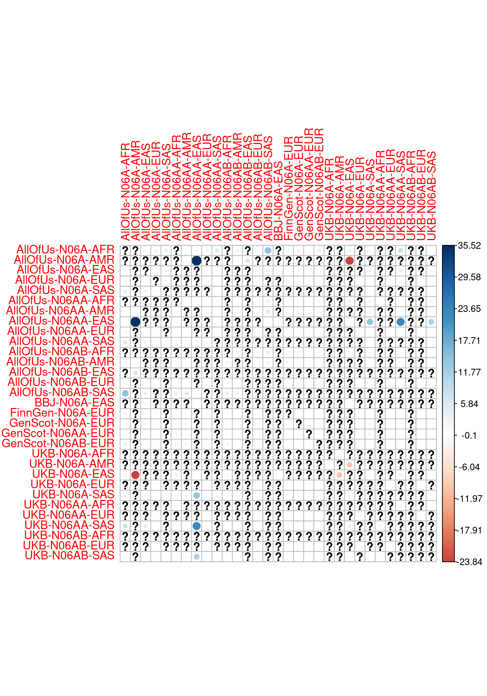
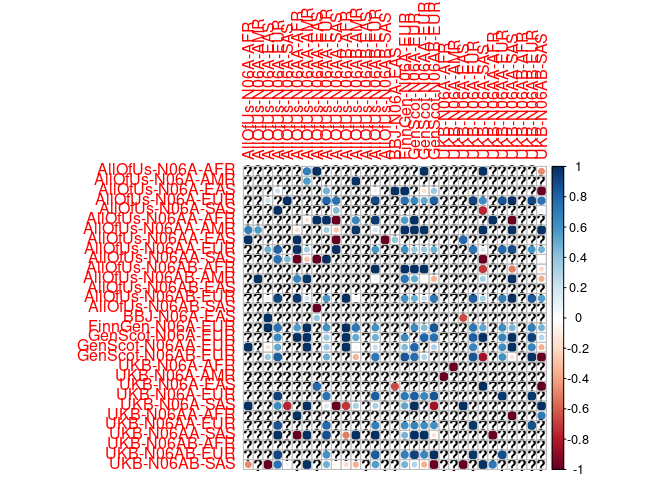

Between GWAS genetic correlations
================

``` r
library(readr)
library(dplyr)
library(ggplot2)
library(corrplot)
```

Read in LDSC (within-ancestry) and Popcorn (cross ancestry) genetic
correlation estimates.

``` r
ldsc <- read_csv(here::here("manuscript/tables/rg_ldsc_gwas.csv"))
```

    ## Rows: 166 Columns: 18
    ## ── Column specification ─────────────────────────────────────────────────────────────────────────────────────────
    ## Delimiter: ","
    ## chr  (8): p1_cohort, p1_pheno, p1_cluster, p1_version, p2_cohort, p2_pheno, p2_cluster, p2_version
    ## dbl (10): rg, se, z, p, h2_obs, h2_obs_se, h2_int, h2_int_se, gcov_int, gcov_int_se
    ## 
    ## ℹ Use `spec()` to retrieve the full column specification for this data.
    ## ℹ Specify the column types or set `show_col_types = FALSE` to quiet this message.

``` r
popcorns <- read_csv(here::here("manuscript/tables/rg_popcorn_gwas.csv"))
```

    ## Rows: 168 Columns: 12
    ## ── Column specification ─────────────────────────────────────────────────────────────────────────────────────────
    ## Delimiter: ","
    ## chr (8): p1_cohort, p1_pheno, p1_cluster, p1_version, p2_cohort, p2_pheno, p2_cluster, p2_version
    ## dbl (4): pgi, SE, Z, P (Z)
    ## 
    ## ℹ Use `spec()` to retrieve the full column specification for this data.
    ## ℹ Specify the column types or set `show_col_types = FALSE` to quiet this message.

``` r
rgs <-
bind_rows(
    ldsc,
    rename(popcorns, rg = pgi, se = SE, z = Z, p = `P (Z)`)
)
```

Set up dataset names for correlation matrix

``` r
p1_datasets <- rgs |>
    mutate(dataset = str_c(p1_cohort, p1_pheno, p1_cluster, sep = "-")) |>
    pull(dataset)

p2_datasets <- rgs |>
    mutate(dataset = str_c(p2_cohort, p2_pheno, p2_cluster, sep = "-")) |>
    pull(dataset)

datasets <- unique(c(p1_datasets, p2_datasets))

rg <- rgs |> pull(rg)
```

Matrix to store correlations

``` r
rg_matrix <- matrix(data = NA,
                    nrow = length(datasets),
                    ncol = length(datasets),
                    dimnames = list(datasets, datasets))

for(i in seq_along(rg)) {
    dataset1 <- p1_datasets[i]
    dataset2 <- p2_datasets[i]
    rg_matrix[dataset1, dataset2] <- rg_matrix[dataset2, dataset1] <- rg[i]
}
```

Squish genetic correlations to (-1, 1)

``` r
rg_matrix_squish <- rg_matrix
rg_matrix_squish[rg_matrix > 2] <- NA
rg_matrix_squish[rg_matrix < -2] <- NA
rg_matrix_squish[rg_matrix < 2 & rg_matrix > 1] <- 1
rg_matrix_squish[rg_matrix > -2 & rg_matrix < -1] <- -1
```

Correlation plots

``` r
corrplot(rg_matrix, is.corr = FALSE)
```

<!-- -->

``` r
corrplot(rg_matrix_squish)
```

<!-- -->
