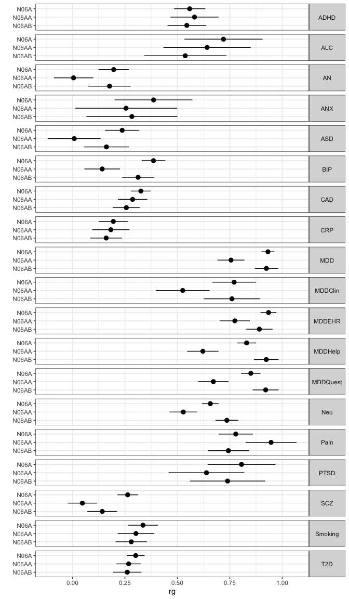

Meta genetic correlations
================

LDSC genetic correlations with external phenotypes.

``` r
library(dplyr)
library(readr)
library(ggplot2)
```

LDSC tables

``` r
ldsc_external <- read_csv(here::here("manuscript/tables/rg_ldsc_meta_external.csv"))
```

    ## Rows: 57 Columns: 16
    ## ── Column specification ─────────────────────────────────────────────────────────────────────────────────────────
    ## Delimiter: ","
    ## chr  (5): p1_meta, p1_method, p1_pheno, p1_cluster, p2_pheno
    ## dbl (11): p1_version, rg, se, z, p, h2_obs, h2_obs_se, h2_int, h2_int_se, gc...
    ## 
    ## ℹ Use `spec()` to retrieve the full column specification for this data.
    ## ℹ Specify the column types or set `show_col_types = FALSE` to quiet this message.

Plot

``` r
ggplot(ldsc_external, aes(x = factor(p1_pheno, levels = rev(unique(p1_pheno))), y = rg, ymin = rg + qnorm(0.025)*se, ymax = rg + qnorm(0.975)*se)) +
geom_pointrange() +
facet_grid(p2_pheno ~ .) +
scale_x_discrete('') +
coord_flip() +
theme_bw() +
theme(strip.text.y = element_text(angle = 0))
```

<!-- -->

Get subsets for description

``` r
n06a <- ldsc_external |>
  filter(p1_pheno == "N06A") |>
  mutate(r_g = round(rg, 3), r_g_se = round(se, 3))
n06aa <- ldsc_external |>
  filter(p1_pheno == "N06AA") |>
  mutate(r_g = round(rg, 3), r_g_se = round(se, 3))
n06ab <- ldsc_external |>
  filter(p1_pheno == "N06AB") |>
  mutate(r_g = round(rg, 3), r_g_se = round(se, 3))
```

Of the phenotypes tested, antidepressant exposure was most strongly
genetically correlated with MDD ($r_g$ = 0.932, SE = 0.016), PTSD ($r_g$
= 0.806, SE = 0.083), and back pain ($r_g$ = 0.778, SE = 0.042). Among
different definitions of major depression, AD exposure was most strongly
genetically correlated with EHR diagnosis ($r_g$ = 0.934, SE = 0.019)
and least with clinically-ascertained depression ($r_g$ = 0.771, SE =
0.053). Exposure to N06AA antidepressants was less strongly correlated
than N06AB to MDD (N06A: $r_g$ = 0.756, SE = 0.033; N06AB: $r_g$ =
0.924, SE = 0.028) but more strongly correlated with back pain (N06A:
$r_g$ = 0.947, SE = 0.062; N06AB: $r_g$ = 0.743, SE = 0.05).
